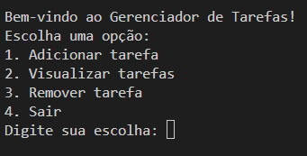

# Gerenciador de Tarefas

Um simples sistema de gerenciamento de tarefas em Python que permite adicionar, visualizar e remover tarefas. O programa oferece um menu interativo para facilitar a navegação.

## Funcionalidades

- Adicionar tarefas com uma descrição personalizada.
- Visualizar todas as tarefas pendentes.
- Remover tarefas com base no número exibido.
- Interface de texto simples e amigável.

## Como Usar

1. Execute o programa. Você verá um menu com opções.
2. Escolha uma opção digitando o número correspondente.
3. Siga as instruções fornecidas na tela para adicionar, visualizar ou remover tarefas.
4. Para sair do programa, selecione a opção "Sair".

## Exemplo de Uso

Aqui está um exemplo de como o programa funciona:



## Pré-requisitos

- Python 3.x instalado no seu sistema.

## Executando o Programa

Para executar o programa, siga estes passos:

1. Clone este repositório:
   ```bash
   git clone https://github.com/seuusuario/gerenciador-tarefas.git
   cd gerenciador-tarefas
